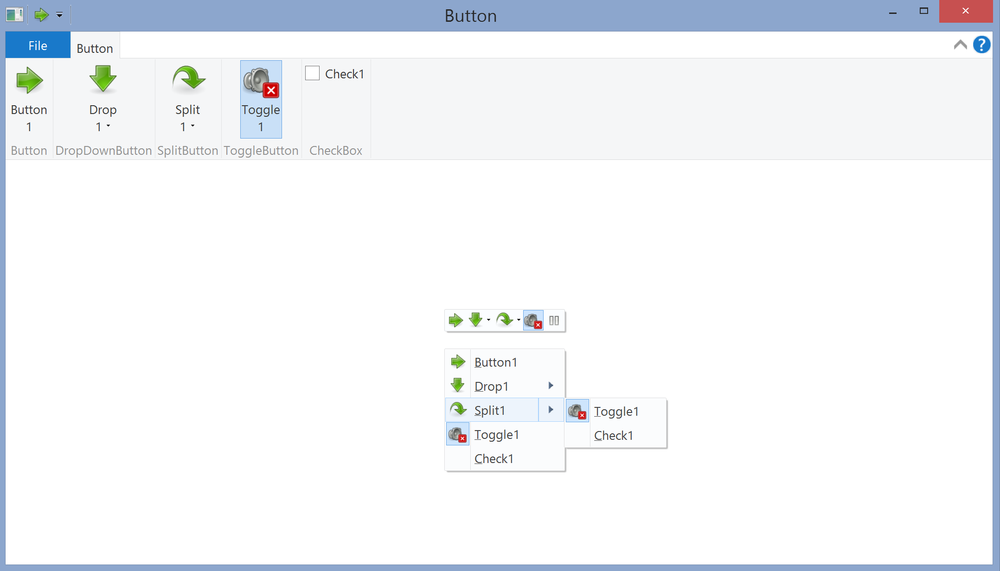

# Fzeet

Ruby FFI (x86) bindings to (and rubyesque APIs on top) GUI/COM related Windows APIs



```ruby
require 'fzeet'

include Fzeet

Application.run(View.new) { |window|
	UIRibbon.new(window).
		on(CmdButton1) { message 'on(CmdButton1)' }.
		on(CmdSplit1) { message 'on(CmdSplit1)' }.
		on(CmdToggle1) { window.ribbon[CmdCheck1].toggle(:checked) }.
		on(CmdCheck1) { window.ribbon[CmdToggle1].toggle(:checked) }.

		on(CmdHelp) { message 'on(CmdHelp)' }

	window.ribbon[CmdToggle1].checked = true

	window.
		on(:draw, Control::Font) { |dc| dc.sms 'Right-click (or menu key) for context menu' }.

		on(:contextmenu) { |args|
			window.ribbon.contextualUI(CmdContextMap1, args[:x], args[:y])
		}
}
```

## Install

gem install fzeet

## Use

See examples folder

## Issues

- uses the ANSI versions of Windows bindings (for UNICODE bindings to some essential GUI stuff check out the [windows_gui](https://rubygems.org/gems/windows_gui) gem)
- declares DPI awareness, but the examples use pixel coordinates
- uses _id2ref, so passing -X+O to jrubyw is required when running with JRuby
- Windows version identification is outdated
- there is a better than the bundled COM bindings library, check out the [windows_com](https://rubygems.org/gems/windows_com) gem
